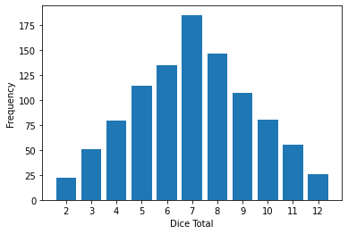
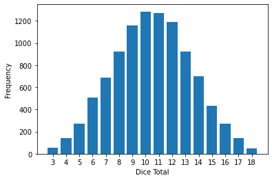
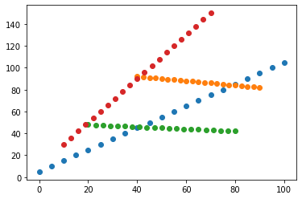
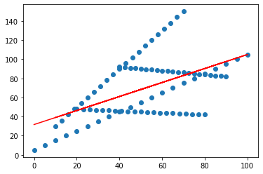

## **Yalini Brhanavan - GMIT - H.Dip Data Analytics**

* Tasks assessment for Fundamentals of Data Analysis 
* Sep 2020

----------------------------------------------------------------------------------------------------------------------------------------

**TASKS QUESTIONS:**

1.   *Write a Python function called counts that takes a list as input and returns a dictionary of unique items in the list as keys and the number of
times each item appears as values.*  
The function **CountFrequency** accpets as list as inout and returns unique elements of the list as keys and the corresponding counts.
For example, 
<code>  CountFrequency(['A', 'A', 'B', 'C', 'A']) </code>  
returns {'A': 3, 'B': 1, 'C': 1}  

2.  *Write a Python function called dicerolls that simulates
rolling dice.*  
The function **dicerolls** take two parameters: the number of dice k and
the number of times to roll the dice n and returns a dictionary with the number of times each possible total face value occurred. 

    For example, to call dicerolls with k=2 and n=1000 may produce an output like this
    <code>  dicerolls(2,1000) </code>  
    {2: 23, 3: 50, 4: 89, 5: 95, 6: 146, 7: 179, 8: 148, 9: 115, 10: 75, 11:  59, 12: 21}

3.   *Visualising Binomial Distribution*   
I defined a function **plot_dicerolls** that takes in a dictionary with keys and counts and plots the distribution as a bar chart

Calling plot_dicerolls on the results obtained from 2 produces the following chart.  

When 3 dice are rolled the total could be any number between 3 and 18. The barcart below shows the result of calling <code> plot_dicerolls(dicerolls(3,10000)) </code> 
 

4.   *Simpson’s paradox*  
First I produced 4 sets of X values. Then I modelled Y as a linear function of X. 

* Dataset 1:  x is a set of 21 evenly spaced numbers between 0 and 100. 
  x = [0, 5, 10....95, 100]
  y values are calculated using the linear function y = x +5 

* Dataset 2:  x is a set of 21 evenly spaced numbers between 40 and 90. 
  x = [40, 42.5, 45,...90]
  y = -0.2 x + 100

* Dataset 3:  x is a set of 21 evenly spaced numbers between 20 and 80. 
  x = [20,23,26...77, 80]
  y =  0.1 x + 50

* Dataset 4:  x is a set of 21 evenly spaced numbers between 10 and 70. 
  x = [10,13,16...67,70]
  y = 2x + 10

In the chart below, each data set is plotted in a different colour. When plotted in a different colour the linear trend within each group is very clear. 

 

However when all datapoints are plotted using a single colour this trend  disappears. This phenomenon is known as Simpson's paradox. 

 

----------------------------------------------------------------------------------------------------------------------------------------
**How to run the file:**
1.  Open Task 2020.ipynb in Jupyterlab or Jupyter notebook .
2. click the Kernel button and select Restart & Run All. 
3. when the pop window appear select Restart and Run All Cells. 

**REFERENCES:** 

[Q1]: 
* https://www.coursera.org/lecture/python-data/9-2-counting-with-dictionaries-HLgKK 
* https://www.geeksforgeeks.org/python-count-number-of-items-in-a-dictionary-value-that-is-a-list/
* https://www.geeksforgeeks.org/counting-the-frequencies-in-a-list-using-dictionary-in-python/
* https://docs.python.org/3.1/library/collections.html
* https://www.geeksforgeeks.org/python-counter-objects-elements/
* https://medium.com/khaliat/the-counter-class-in-python-b8be31d5e4f6

[Q2]: 
* https://numpy.org/doc/stable/reference/random/generated/numpy.random.Generator.integers.html#numpy.random.Generator.integers
* https://medium.com/@soumen.atta/simulating-randomness-using-pythons-numpy-random-module-ad96023daee7
* https://stackoverflow.com/questions/9001509/how-can-i-sort-a-dictionary-by-key
* https://pythonbasics.org/matplotlib-bar-chart/
* https://matplotlib.org/3.3.3/api/_as_gen/matplotlib.pyplot.bar.html
* https://numpy.org/doc/stable/reference/generated/numpy.sum.html
* https://stackoverflow.com/questions/13567345/how-to-calculate-the-sum-of-all-columns-of-a-2d-numpy-array-efficiently
* https://www.geeksforgeeks.org/numpy-sum-in-python/

[Q3]:
* https://cmdlinetips.com/2018/12/simulating-coin-toss-experiment-with-binomial-random-numbers-using-numpy/
* https://numpy.org/doc/stable/reference/random/generated/numpy.random.Generator.random.html#numpy.random.Generator.random
* https://matplotlib.org/3.1.1/api/_as_gen/matplotlib.pyplot.hist.html

[Q4]:
* https://en.wikipedia.org/wiki/Simpson%27s_paradox
* https://numpy.org/doc/stable/reference/generated/numpy.linspace.html
* https://matplotlib.org/3.3.3/api/_as_gen/matplotlib.pyplot.subplots.html
